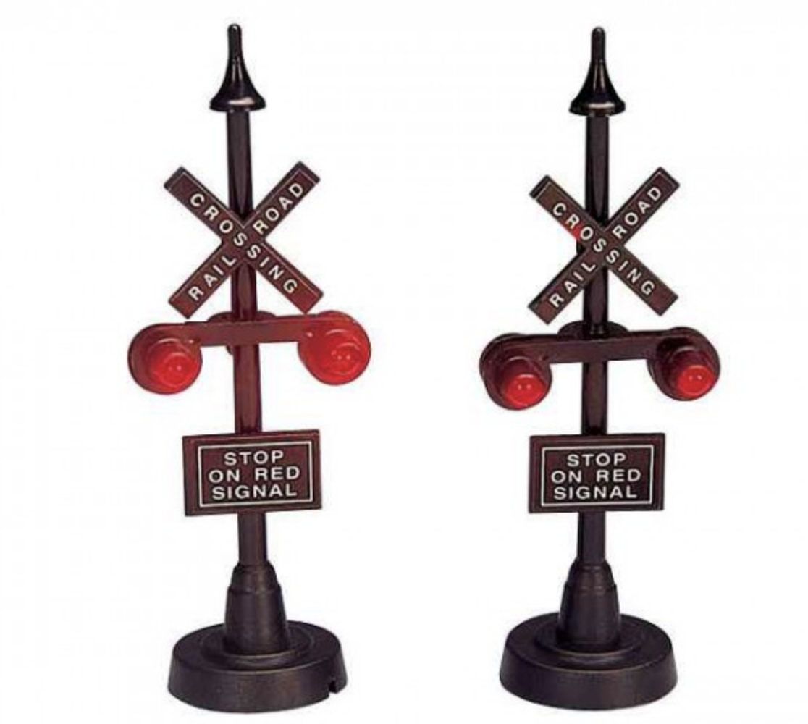

# ChristCrossing
<h1>Christmas Deco Railroad Crossing</h1>
<h2>Some history</h2>

Sometime ago I ended up buying a tiny house from
<a href="https://www.lemaxcollection.com/home">Lemax</a> as Christmas decoration.
You probably have seen those nice mini towns yourself in a local home deco shop around Christmas.
After your first house you realize that "a few more" is better.
Soon it became a small collection which off course needed some accesoiries as well. That is where
the nice railroad crossing came in.

But unfortunately the simple transistor bases blinking installation was not robust enough to
survive me accidentally  connecting it to the wrong voltage. This was a nice moment to start learning
myself how to program an Arduino and connect the 4 lights of the railroad crossing to it.

<h2>The project</h2>

So what you find here is my first ever public Git repository with my first ever build Arduino which
actually did something usefull...It is a very small project and I doubt if someone will ever find this usefull.
Well, for me it was since it really solved my issue and I learned something about it.

An Arduino micro does the trick by blinking the lights in the same pattern as used for the Dutch railways.
See source code. For the ones who are not really familiar with Dutch acronyms. An AHOB installation
is used for Automatic Half 'Overweg' Barriers, where 'overweg' is Dutch for railroad crossing, and Half
since originally they only blocked only 'your' halve of the road. After some time the AHOB stops, in reality
there will not be a train always, and it restarts after a minute or so.The pins used for the LEDS are configurable.
I used 4 pins to ensure the load for 1 pin stays < 20mA. In theory you could do with 2 pins
I think, since both poles will use the same rhythm. 
And if you are really clever and have an inverter lying around in the shack, then in theory one pin
should be doable as well. But that is not funny ;-) and goes beyond this project.

Have fun, Rudi

